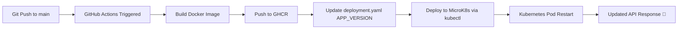

# Automated Kubernetes deployment via GitHub Actions

## Overview
This project demonstrates a fully automated **local CI/CD pipeline** with:
- **Docker** for containerization
- **GitHub Actions** for automation
- **MicroK8s** as a local Kubernetes cluster
- **FastAPI** for a simple API service
- **GHCR** image registry for Docker container

## Technologies Used
- Docker
- Kubernetes (K3s)
- GitHub Actions
- FastAPI (Python)

## Features
- Automatic Docker image build and push to GitHub Container Registry (GHCR)
- Automatic deployment to MicroK8s on every push
- Dynamic NodePort allocation
- APP_VERSION updated to Git commit hash for each deployment

## Project Structure
```
devops-portfolio/
├── app/
│   ├── main.py              # FastAPI application
│   └── requirements.txt     # Python dependencies
│
├── k8s/
│   ├── deployment.yaml      # Kubernetes Deployment
│   └── service.yaml         # Kubernetes Service (NodePort)
│
├── .github/
│   └── workflows/
│       └── ci-cd.yaml       # GitHub Actions pipeline
│
├── Dockerfile               # Container build instructions
├── .dockerignore            # Ignore unnecessary files in build
├── README.md                # Project documentation + diagram
```

## How it Works
1. Push code to `main`
2. GitHub Actions workflow:
   - Builds Docker image
   - Pushes to GHCR
   - Updates deployment YAML with new `APP_VERSION`
   - Applies deployment & service to MicroK8s
3. The pod restarts, and the API serves the new message automatically

## Test the API
```bash
NODE_PORT=$(kubectl get svc api-service -o jsonpath='{.spec.ports[0].nodePort}')
curl http://<your-node-ip>:$NODE_PORT
```

## Visual CI/CD Flow
Git Push → GitHub Actions → Docker Build → GHCR Push → MicroK8s Deployment → API Updated

Each push to `main` automatically rebuilds, redeploys, and updates the running application — demonstrating a fully working local CI/CD pipeline.



## Notes
Uses self-hosted runner pointing to local MicroK8s kubeconfig  
NodePort is dynamic to avoid conflicts  
Cost-efficient portfolio project  

